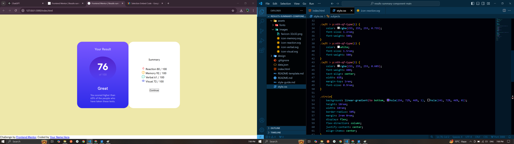
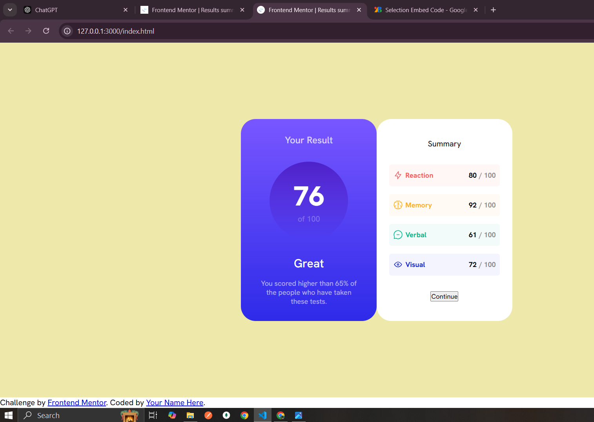
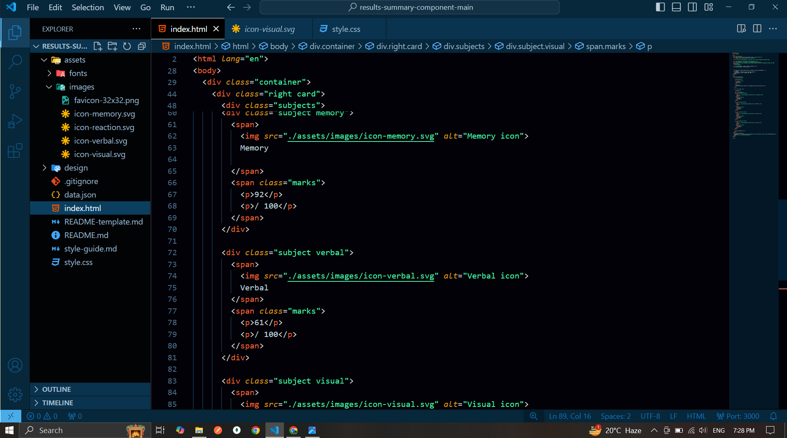

# Frontend Mentor - Results summary component solution

This is a solution to the [Results summary component challenge on Frontend Mentor](https://www.frontendmentor.io/challenges/results-summary-component-CE_K6s0maV). Frontend Mentor challenges help you improve your coding skills by building realistic projects. 

## Table of contents

- [Overview](#overview)
  - [The challenge](#the-challenge)
  - [Screenshot](#screenshot)
  - [Links](#links)
- [My process](#my-process)
  - [Built with](#built-with)
  - [What I learned](#what-i-learned)
  - [Continued development](#continued-development)
- [Author](#author)
- [Acknowledgments](#acknowledgments)

## Overview

### The challenge

Users should be able to:

- View the optimal layout for the interface depending on their device's screen size
- See hover and focus states for all interactive elements on the page
- **Bonus**: Use the local JSON data to dynamically populate the content
- **Bonus Extra**: If your press the continue button it will change the value of result

### Screenshot

## My process

### Built with

- HTML5
- Vanilla CSS
- Vanilla JavaScript

### What I learned

I know how to work with React.js but in this specific project I didn't used it but instead tried to work with Direct DOM maniplation using Vanilla JS.

The tricky part of this project was the CSS like the two card one blue and one white the purple have all rounded corners but the white has only two rounded corners to the right and you can see the light shadow around the white card that extends to thr blue card, so in order to do that I had to put and another div behind the two cards.

### Continued development

I will be working on polishing and improving my frontend skills

## Author

- LinkedIn - [Zia Alam](https://www.linkedin.com/in/zia-alam-102572227/)
- Frontend Mentor - [@ZiaAlam7](https://www.frontendmentor.io/profile/ZiaAlam7)
- Github - [@ZiaAlam7](https://github.com/ZiaAlam7)

## Acknowledgments

All the YouTube community that give out amazing free to learn resources.